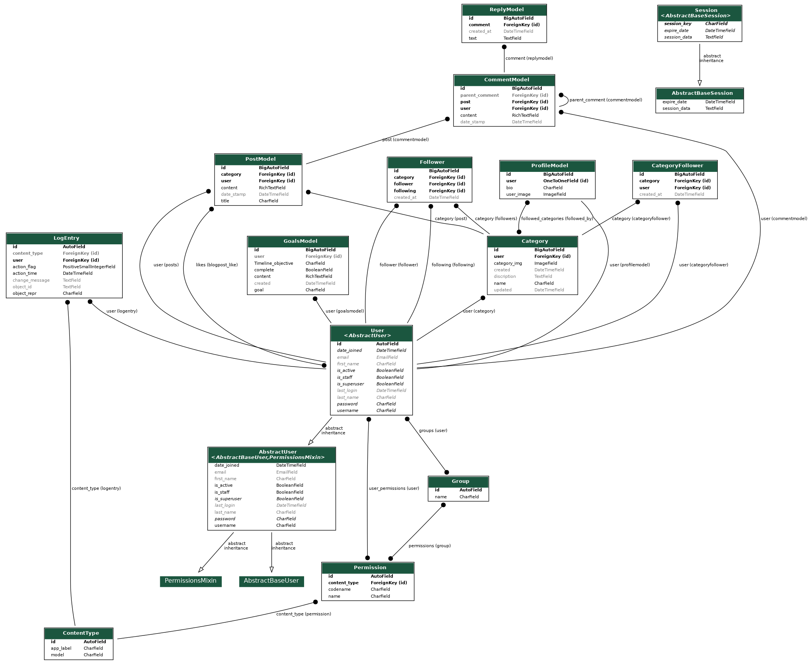

# WWINS

  

  

  

  

WWINS is a social media platform built with Django, Bootstrap 5, HTML, and CSS, inspired by Reddit. It focuses on self-development and learning new skills. What sets WWINS apart is the "goals" section in the user profiles which encourages personal development and collaboration amongst users.

## Table of Contents 📘
- [Features](#features-🚀)
- [Technologies](#technologies-💻)
- [Installation](#installation-🛠️)
- [For Linux](#for-linux-🐧)
- [For Windows](#for-windows-🪟)
- [Usage](#usage-🖥️)
- [Contributing](#contributing-🤝)
- [License](#license-📜)
- [Models](#Models-📊)

## Features 🚀
- **User Profiles**: Users can create profiles, showcasing their posts and goals.
- **Post & Categories**: Users can create posts under specific self-development and learning categories.
- **Community Goals**: Users can create goals, mark them as accomplished, and set a target date.
- **Follow & Collaborate**: Users can follow each other and collaborate on goals.
- **Community Guidelines**: Users are guided by community guidelines for posting and interaction.
- **Customizable Categories**: Users can create and edit custom categories for posts.
- **Search Functionality**: Users can search for posts, categories, and other users.
- **CRUD Functionality**: Users can create, read, update, and delete posts and categories.
- **Account Activation**: New users need to activate their account through an activation link sent to their email.
- **Password Reset**: Users can request a password reset through email.

## Technologies 💻
WWINS is built with the following technologies:
- [Django](https://www.djangoproject.com/)
- [Python3](https://www.python.org/downloads/)
- [Bootstrap 5](https://getbootstrap.com/docs/5.0/getting-started/introduction/)
- HTML5
- CSS3

## Installation 🛠️

### For Linux 🐧

1. Clone this repository
   `git clone https://github.com/SebastianMou/wwins_2.0`

2. Change to the repository directory
   `cd wwins_2.0`

3. Create a virtual environment
   `python3 -m venv myenv`

4. Activate the virtual environment
   `source myenv/bin/activate`

5. Install the required dependencies
   `pip install -r requirements.txt`

6. Run the Django migrations
   `python3 manage.py makemigrations && python3 manage.py migrate`

7. Start the Django server
   `python3 manage.py runserver`

### For Windows 🪟

1. Clone this repository
   `git clone https://github.com/SebastianMou/wwins_2.0`

2. Change to the repository directory
   `cd wwins_2.0`

3. Create a virtual environment
   `python -m venv myenv`

4. Activate the virtual environment
   `myenv\Scripts\activate`

5. Install the required dependencies
   `pip install -r requirements.txt`

6. Run the Django migrations
   `python manage.py makemigrations && python manage.py migrate`

7. Start the Django server
   `python manage.py runserver`

## Usage 🖥️
1. Visit `localhost:8000` in your browser...
2. Register for an account or login if you already have one.

## Contributing 🤝
Contributions, issues, and feature requests are welcome...

## License 📜
[MIT](https://choosealicense.com/licenses/mit/)

## Models 📊

  

